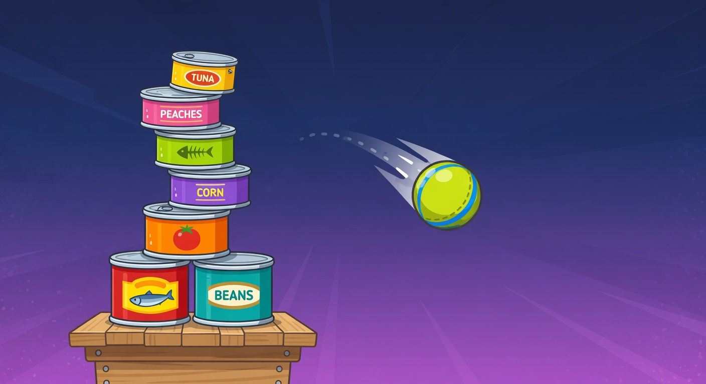
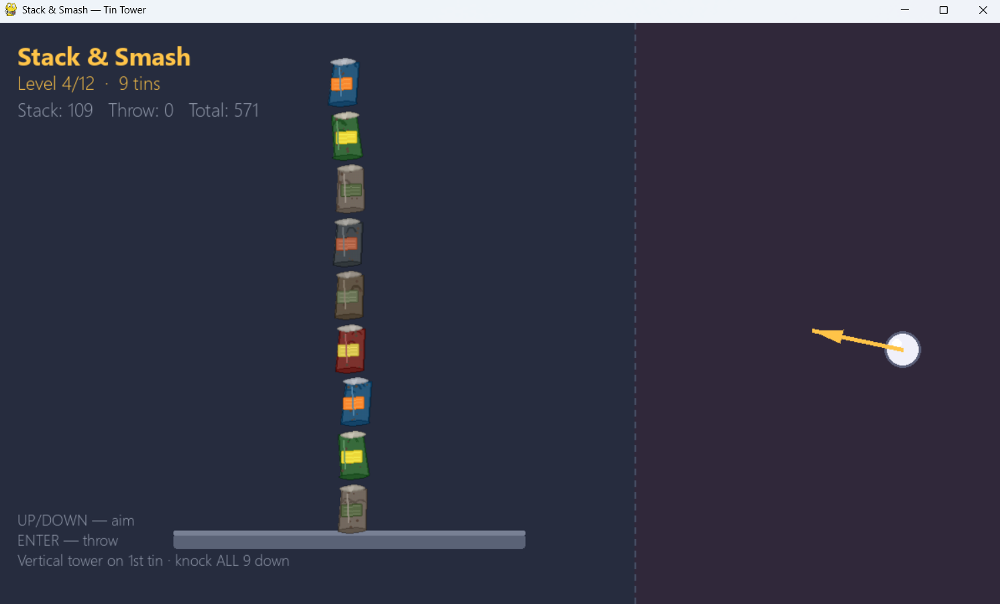
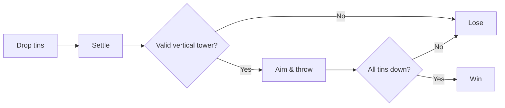
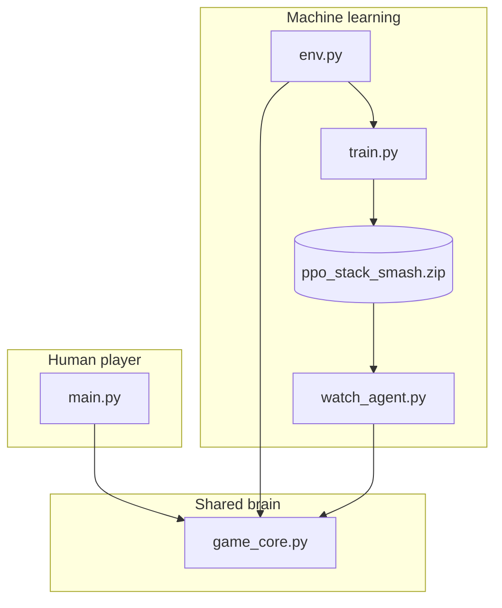
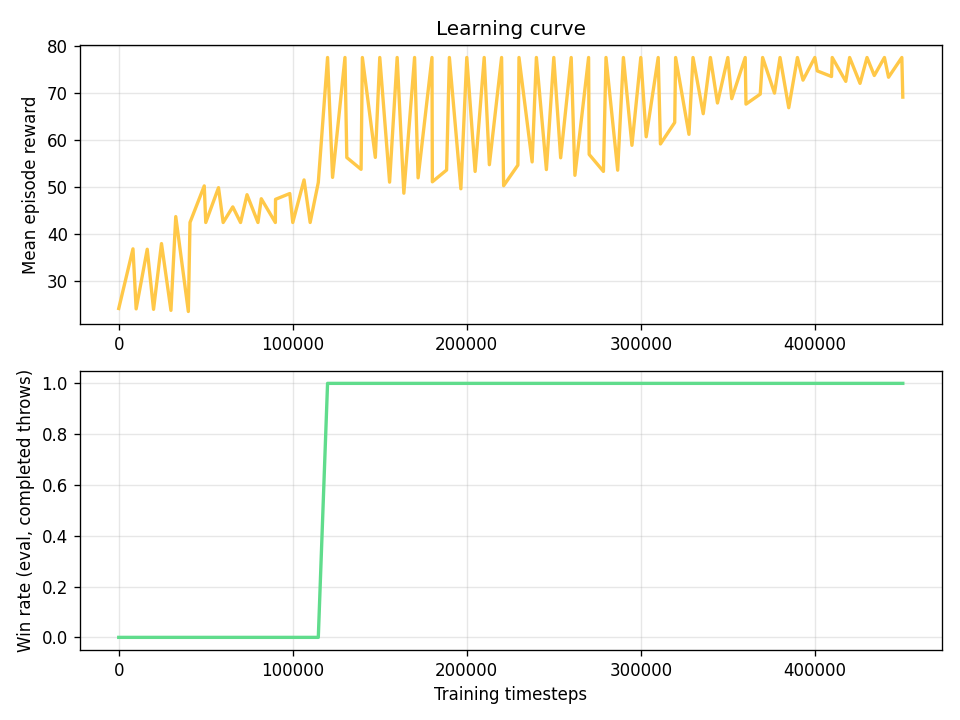
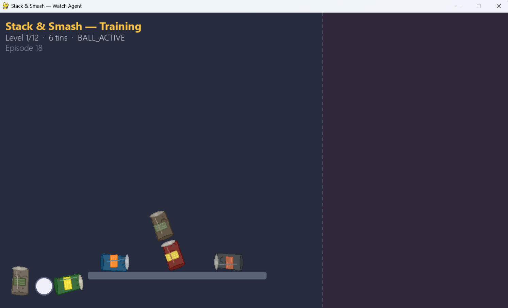
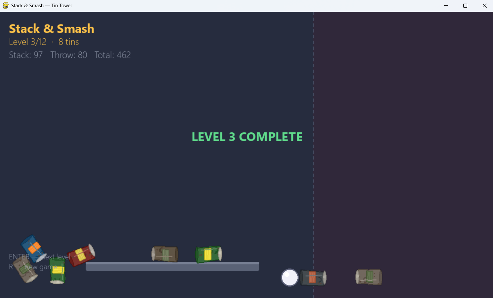

<p align="center">
  
</p>

<h1 align="center">Stack & Smash</h1>

<p align="center">
  <strong>Stack tins. Build the tower. Throw the ball. Knock them all down.</strong>
</p>

<p align="center">
  <a href="#play">Play</a> ·
  <a href="#ai-agent">AI Agent</a> ·
  <a href="#how-it-works">Rules</a> ·
  <a href="#setup">Setup</a>
</p>

<p align="center">
  
  
  
  
</p>

---

## At a glance

| | |
|:---:|:---|
| 🎮 | **Physics stacking game** - Pygame + Pymunk |
| 🤖 | **Local RL agent** - trained with PPO Reinforcement Learning Algorithm (Stable-Baselines3) |
| 🎯 | **Same rules** for human and AI - one shared `game_core.py` |
| 🏆 | **Level 1 max score** = **129** (perfect tower + full knockdown) |

<p align="center">
  
</p>

<p align="center"><em>Stack every tin on the first can · Throw · Crush the tower to win</em></p>

---

## How it works

<a id="how-it-works"></a>



**Tower rule** - Only a **vertical column on your first tin** counts. Side placements or cans off the platform do not count.

**Win** - Every level tin on that tower, then **every** one falls after the throw.

---

## Play

<a id="play"></a>

```powershell
pip install -r requirements.txt
python main.py
```

| | Control |
|:---:|:---|
| Move tin | Mouse · Arrow keys · WASD |
| Drop | **Space** · Left click |
| Lock stack | **Enter** (after all tins placed) |
| Aim | **Up / Down** or **W / S** |
| Throw | **Enter** |
| Restart | **R** |

**Scoring** - `Stack points + Throw points` on the UI. Taller tower = more stack pts · Each knocked tin = 10 pts.

---

## AI agent

<a id="ai-agent"></a>

The agent learns with **reinforcement learning** (not defined rules). It practices in a Gymnasium environment, then you watch the saved policy play.



| Command | What it does |
|---------|----------------|
| `python train.py --timesteps 500000 --level 1` | Train agent using level 1 500000 times (~12 min on average) |
| `python watch_agent.py` | **Watch only** - saved model plays the game, no training |
| `python train.py --watch` | Train **and** watch live demos (slower training) |

> **Note:** `watch_agent` prints `reward=~77` - that is the **RL training score**, not the human UI total (**129** max on level 1).

<p align="center">
  
</p>

<p align="center"><em>Learning curve saved during training · <code>logs/training_curve.png</code></em></p>

---

## Setup

<a id="setup"></a>

```powershell
git clone <your-repo-url>
cd Game-Playing-Reinforcement-Learning-Agent

pip install -r requirements.txt      # play
pip install -r requirements-rl.txt   # train + watch agent
```

**Requires** `assets/tin_garbage_0.png` … `tin_garbage_16.png` (included in repo).

---

## Project layout

```
tin-tower-game/
├── main.py              # Human game
├── game_core.py         # Rules + physics (shared)
├── env.py               # RL environment
├── train.py             # PPO training
├── watch_agent.py       # Demo trained agent
├── sprites.py           # Loads tin artwork
├── assets/              # Tin PNGs
├── models/              # Trained agent (.zip)
└── logs/                # Training curve
```

---

## Levels

| Level | Tins |
|:-----:|:----:|
| 1 | 6 |
| 2 | 7 |
| … | … |
| 12 | 17 |

Use `--level N` with `train.py` and `watch_agent.py` for a specific level.

---

## Screenshots

<p align="center">
  
  
  
</p>

| File | Suggested content |
|------|-------------------|
| `docs/images/screenshot-human.png` | Human playing and valid tower |
| `docs/images/screenshot-agent.png` | `watch_agent.py` mid-throw |
| `docs/images/screenshot-win.png` | Win / score UI |


---

## Deeper docs

| Resource | Description |
|----------|-------------|
| `Stack_Smash_Presentation_Study_Guide.pdf` | Full talk track & Q&A (if present) |
| `game_core.py` | Scoring formulas & tower logic |

---

<p align="center">
  <sub>Built with Pygame · Pymunk · Gymnasium · Stable-Baselines3</sub>
